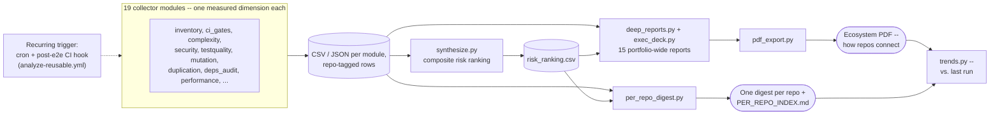

# Repo Analyser

Multi-dimensional, reproducible analysis for a git repo or a portfolio of repos — git history,
defect-escape rate, dependency graphs, duplication, security scanning, mutation testing, and
*real* (executed, not inferred) test quality. Every number in the output traces back to a
rerunnable command.

**New here?** Run **Quick start**, then skim **What it measures**. Everything past that is
reference material — read it when a specific module needs it, not before.

## Quick start

```bash
bash scripts/setup.sh              # one command: venv, deps, and every scanner this tool uses
repo-analyser analyze /path/to/repo
```

Report lands at `<out>/deep/<target>-analysis-report.pdf` (default `<out>` is `analyses/`).

⚠️ **Before pointing this at any repo**, read **Security model** below — it executes that repo's
own code.

## What it measures

| Module | Question it answers | Tool(s) |
|---|---|---|
| `inventory` | Which repos are active/dormant, who owns them, bus-factor risk | `git log` |
| `ci_gates` | Does CI actually run tests, or just deploy | `.github/workflows` parser |
| `ontology` | What does the work actually consist of (features vs. fixes vs. ops) | deterministic rule classifier |
| `escape` | How often does a bug ship, and how long does it live in prod | SZZ algorithm (PyDriller + `git blame`) |
| `churn` | Which files change most, which files change *together* | [code-maat](https://github.com/adamtornhill/code-maat) |
| `complexity` | Cyclomatic complexity, and complexity×churn hotspots | [lizard](https://github.com/terryyin/lizard) |
| `duplication` | Duplicated code blocks, within and across repos | [jscpd](https://github.com/kucherenko/jscpd) |
| `exact_duplicates` | Byte-identical files across repos (stricter than jscpd) | sha256 |
| `security` | Committed secrets (full history) + vulnerability patterns | [gitleaks](https://github.com/gitleaks/gitleaks), [semgrep](https://github.com/semgrep/semgrep) |
| `depgraph` | Internal import graph, circular dependencies | [dependency-cruiser](https://github.com/sverweij/dependency-cruiser) (JS/TS), `ast` (Python), `go list` (Go) |
| `testquality` | Does the test suite actually pass, right now | real execution: vitest/jest (JS), pytest (Python), `go test` (Go) |
| `e2e_quality` | Does an E2E suite exist, and is it wired into CI (JS/TS only) | Playwright, Cypress, Selenium/WebdriverIO presence + CI step detection |
| `effort` | Per-author/monthly effort mix, candidate toil clusters | derived from `ontology` |
| `deps_audit` | Known-CVE dependency audit + package staleness | [osv-scanner](https://github.com/google/osv-scanner), `npm outdated` |
| `supply_chain` | IaC/Dockerfile misconfigurations + CycloneDX SBOM | [Trivy](https://github.com/aquasecurity/trivy) |
| `lint_quality` | Static analysis with each repo's own linter/config | ESLint (JS), [ruff](https://github.com/astral-sh/ruff) (Python), [staticcheck](https://staticcheck.dev/) (Go) |
| `code_quality` | Keyless SonarQube-style Maintainability Index (Python only) | [radon](https://radon.readthedocs.io/) |
| `mutation` | Are the tests behaviorally meaningful, not just passing | [Stryker](https://stryker-mutator.io/) (JS/TS), [mutmut](https://mutmut.readthedocs.io/) (Python) |
| `performance` | Does a latency/perf budget exist, and is it wired into CI (detection only — no benchmark execution yet, see [`docs/ROADMAP.md`](docs/ROADMAP.md)) | Lighthouse CI / bundlesize / size-limit / artillery config + CI-wiring detection |
| `knowledge_graph` | A real, exportable graph (duplication + shared-dep + coupling + import edges) | [networkx](https://networkx.org/) → GraphML |
| `synthesize` | Composite risk ranking across every dimension above | this repo |
| `per_repo_digest` | One consolidated page per repo, pulling its own findings across every module above | this repo |
| `trends` | Regressions/improvements vs. the last run against this same `--out` dir | this repo |
| `deep_reports` | One markdown report per category, full depth | this repo |
| `exec_deck` | One capstone "Slide N" briefing spec spanning every category | this repo |
| `pdf` | The deep reports + charts, assembled into one PDF | [WeasyPrint](https://weasyprint.org/) |

**A few things worth knowing up front:**

- `mutation` auto-picks its own target: the single highest complexity×churn hotspot per repo that
  isn't itself a test file, and only from repos with a fully-passing suite. See
  [`select_mutation_targets()`](src/repo_analyser/collectors/mutation.py).
- **Language coverage**: `depgraph`/`testquality` cover JS/TS, Python, Go; `mutation` covers JS/TS
  and Python. Every git-history/language-agnostic module (`inventory`, `ci_gates`, `ontology`,
  `escape`, `churn`, `security`) works on any language already; `complexity` covers ~15 via lizard.
  An unsupported combination reports `skipped_reason` explicitly — never a silent empty result.
- Architecture/HLD/LLD capture (a per-target `ARCHITECTURE.md`) is a **manual** step via
  `codebase-memory-mcp`, not a subprocess this tool runs — see **Limitations**.
- Full formula behind every number, plus real bugs found and fixed while building this:
  [`docs/METHODOLOGY.md`](docs/METHODOLOGY.md). Design decisions: [`docs/adr/`](docs/adr/).

## Architecture at a glance

Two report views come out of the same collector data, answering two different questions (see
[ADR-0003](docs/adr/0003-per-repo-digest-reports.md) for why both exist rather than one replacing
the other):

- **Ecosystem view** (existing): `deep_reports.py`/`exec_deck.py`/the PDF — "how does the whole
  portfolio look, and how are these repos connected" (cross-repo duplication, shared dependencies,
  risk ranking).
- **Per-repo view** (new): `per_repo_digest.py` — "what's true about *this one* repo," in one page,
  whether the target is a 26-repo portfolio or this tool analyzing itself.



Both views read the same `--out` dir and re-run independently
(`--modules per_repo_digest` regenerates just the per-repo pages; `--modules deep_reports,exec_deck,pdf`
regenerates just the ecosystem PDF) — neither re-scans anything the other needs.

## Recurring analysis (scheduled or post-E2E)

`.github/workflows/analyze-reusable.yml` is a reusable workflow (`workflow_call`) any repo can
invoke on a schedule and/or right after its own E2E suite finishes, so regressions (a newly-ungated
repo, a newly-committed secret, a dropped mutation score) show up in `trends.py`'s next run instead
of only when someone remembers to run this by hand. It caches `analyses/` between runs
(`actions/cache`, private to the calling repo) so there's a prior baseline to diff against from the
second run onward.

A calling repo adds one of these (not files in *this* repo):

```yaml
# .github/workflows/scheduled-analysis.yml -- weekly
on:
  schedule: [{cron: "0 6 * * 1"}]
  workflow_dispatch: {}
jobs:
  analyze:
    uses: rachit-srivastava-devx/repo-analyser/.github/workflows/analyze-reusable.yml@main
    with:
      modules: "" # full run; see list-modules for a lighter subset

# .github/workflows/post-e2e-analysis.yml -- right after the E2E suite passes
on:
  workflow_run:
    workflows: ["E2E Tests"] # your own E2E workflow's `name:`
    types: [completed]
jobs:
  analyze:
    if: github.event.workflow_run.conclusion == 'success'
    uses: rachit-srivastava-devx/repo-analyser/.github/workflows/analyze-reusable.yml@main
```

**Verification limit, stated plainly**: this reusable workflow is checked for YAML validity and
correct `workflow_call` structure, and its embedded shell passes `shellcheck` clean — it has not
been exercised on a live GitHub Actions runner from this environment (no sandboxed Actions runner
available here). Test it against a real caller workflow before relying on it in production.

## Design system

Charts and the PDF follow **The DevX Doctrine** (v1.0): one accent color (`#1E6FFF`) used
sparingly, Paper/Ink palette, real Inter Tight / Source Serif 4 / JetBrains Mono fonts, hairline
rules, no rounded corners, no shadows, no zebra-striping. Source of truth for exact tokens:
`charts.py`'s module docstring and `pdf_export.py`'s CSS.

## Requirements

`bash scripts/setup.sh` installs or checks all of this in one shot — see **Quick start**. What it
covers:

- **Python 3.10+**, **Java** (for `churn`), **Node.js + npm** (for JS/TS `duplication` /
  `depgraph` / `testquality` / `mutation`)
- **Scanners**, auto-installed via brew/npm: `gitleaks`, `semgrep`, `jscpd`, `osv-scanner`, `trivy`
- **Optional**: `ruff` / `staticcheck` (`lint_quality` on Python/Go), `mutmut` (Python mutation —
  comes with the `dev` extra), a Go toolchain (Go targets only)

A tool missing at runtime doesn't crash the run — its module reports an explicit `skipped_reason`
instead.

<details>
<summary>Env vars, timeouts, and per-target preconditions — expand if a module behaves oddly</summary>

- A working `npm install` in each target repo is a precondition for `depgraph`/`testquality` on
  JS/TS.
- If a target repo pins a Node version other than your default, set
  `REPO_ANALYSER_NODE_BIN=/path/to/node20/bin` so `testquality`/`mutation` run under the right
  runtime — otherwise a version mismatch can get misreported as a test failure.
- `duplication`'s jscpd scan defaults to a 900s timeout; set `REPO_ANALYSER_JSCPD_TIMEOUT=1800`
  (seconds) or higher for an unusually large portfolio — 900s has already proven insufficient
  twice against a real large (Rust+ML) portfolio (see METHODOLOGY.md #30). jscpd's scanned-format
  list is chosen automatically from the languages actually present.
- For Python targets: the target repo's own `.venv/bin/pytest` / `venv/bin/pytest` is used
  automatically when present (preferred over a global `pytest`), so the suite runs against the
  target's own installed dependencies.
- For Go targets: `go` on PATH, with the target's dependencies fetchable (`go list`/`go test` need
  a resolvable module cache).
- `matplotlib`, `networkx`, `markdown`, `weasyprint`, `tabulate` (for `deep_reports`/`pdf`/
  `knowledge_graph`) install automatically via `pip install -e .` — no extra system packages.
- `osv-scanner` powers `deps_audit`'s CVE check — `npm audit` was tried first and dropped, it hung
  repeatedly in testing.
- `trivy` powers `supply_chain`'s IaC/SBOM scan only, deliberately not its CVE-scanning mode —
  `deps_audit` already owns CVEs via osv-scanner against the same lockfiles; running both would
  duplicate findings under two names.
- Dev tooling (`pytest`, `ruff`, `mypy`, `mutmut`) installs via the `dev` extra:
  `pip install -e ".[dev]"`.
- **mutmut on macOS**: a fork-safety hazard in mutmut's own subprocess management (unrelated to
  this tool's own code) can crash a worker — not observed on Linux CI. See `mutation.py`'s module
  docstring for the full root-cause diagnosis.

</details>

## Security model — read this before pointing the tool at a repo you don't already trust

**This tool executes arbitrary code from every repo it analyzes** — `testquality`/`mutation`
really *run* the target's test suite, the same trust boundary as running `npm install` or
`pip install` on a package you haven't audited. Not a bug to be patched; there's no flag that
removes this without also removing the thing the tool is for.

- Only run this against repos you already trust, on a machine/account without access to anything
  sensitive (production credentials, unrelated private repos, cloud API keys).
- A disposable container or VM with no such access is the safest setup — not currently automated
  by this tool.

<details>
<summary>Exactly which modules execute target-repo code, and why — full breakdown</summary>

- `testquality`/`mutation` run each target repo's own `npm run <script>` / `pytest` / `go test` —
  arbitrary target-repo code, by design. A malicious test file, or a malicious `pretest`/`posttest`
  npm lifecycle script, runs exactly as it would if the repo's own maintainer ran it.
- `depgraph` and `mutation` additionally install *this tool's own* chosen packages
  (`dependency-cruiser`, Stryker) *inside* the target repo's directory, via `npx`/`npm install`, so
  peer-dependency resolution works against that repo's own `node_modules`. Both calls pass
  `--ignore-scripts` / `npm_config_ignore_scripts=true` (docs/METHODOLOGY.md #28) so a compromised
  repo's own `.npmrc` or registry config can't hijack that install via a postinstall script — this
  closes one real vector, but does **not** touch the bullet above.

Full per-module breakdown: `docs/ARCHITECTURE.md`'s "Security model" section.

</details>

## Operational cost

- **~2.5 minutes** for a full 24-module run against a small (4-repo) portfolio. Slowest:
  `supply_chain` (Trivy, ~45s) and `security` (gitleaks + semgrep, ~27s) — both scan full git
  history/filesystem trees, so cost scales with repo size and history depth, not repo count.
- `duplication` scans the whole `--out` target's portfolio root in one pass — budget extra time
  (`REPO_ANALYSER_JSCPD_TIMEOUT`) on a large or monorepo-style portfolio.
- `mutation` forks subprocesses of its own (mutmut/Stryker) — avoid running other heavy concurrent
  work alongside it.
- Backs off automatically under real swap/memory pressure (`core.util.safe_worker_count`), but
  only for this tool's own thread pool — a separately-running heavy process on the same machine
  isn't covered.

<details>
<summary>Full capacity-risk detail — real incidents hit while building this</summary>

Two capacity/resource risks worth knowing before a first real run, both encountered directly while
building this tool:

- **`mutation` forks subprocesses of its own** (mutmut on Python, Stryker on JS/TS) — running this
  tool's own analysis loop with any additional concurrency on top of `mutation` specifically is
  deliberately avoided in this codebase's own `core.util.run_concurrent` for exactly this reason
  (see its docstring). mutmut's own fork-safety issue on macOS is documented in `mutation.py`'s
  module docstring and is a real, once-crashed-the-host risk, not a hypothetical one — mutmut
  `>=3.7.0` (this project's own pin) already defaults away from it, but don't run an older mutmut
  against this tool without checking that default first.
- **Don't run this untuned on a memory-constrained machine.** This tool's own concurrency helper
  (`core.util.safe_worker_count`) backs off automatically when `sysctl vm.swapusage` shows real
  swap pressure (6000MB used, the same threshold as a real resource-crisis incident on the machine
  this was built on) — but that only protects *this tool's own* thread pool. It does not, and
  cannot, protect against a separately-running heavy process (another analysis, another tool)
  competing for the same machine's memory at the same time.

</details>

## Usage

First time? See **Quick start** above. Everything else:

```bash
# Analyze a single repo
repo-analyser analyze /path/to/one/repo

# Analyze a portfolio (a directory whose immediate children are git repos)
repo-analyser analyze /path/to/org/repos --out analyses/myorg

# Just the fast, no-install-required modules
repo-analyser analyze /path/to/repos --modules inventory,ci_gates,ontology,escape

# Skip the slow ones (churn/complexity/duplication/security/depgraph/testquality/deps_audit/supply_chain/lint_quality/mutation)
repo-analyser analyze /path/to/repos --skip-slow

# Full depth: every module, then the per-category deep reports and a PDF
repo-analyser analyze /path/to/repos

# Regenerate just the report layer from data already on disk (fast, no re-scan)
repo-analyser analyze /path/to/repos --out analyses/myorg --modules deep_reports,exec_deck,pdf

# A module timed out or errored (see run_log.json) -- re-run just that, not the whole portfolio
repo-analyser analyze /path/to/repos --out analyses/myorg --retry-failed

repo-analyser list-modules
repo-analyser report analyses/myorg   # regenerate REPORT.md only
```

Without installing: `python3 -m repo_analyser analyze ...` works the same way (needs `src/` on
`PYTHONPATH`, or `pip install -e .`).

**Output**: `<out>/` gets one CSV or JSON per module, plus `run_log.json` (what ran, what failed,
how long each module took). A module failing doesn't stop the others.
`<out>/deep/<target>-analysis-report.pdf` and `<out>/CAPSTONE_DECK.md` are both derived entirely
from that CSV/JSON — rerun `--modules deep_reports,exec_deck,pdf` alone any time you want fresh
documents without re-scanning anything.

`analyses/` is gitignored on purpose: this repo ships the tool, not one run's findings, and a real
run's output includes secret-scan fragments and CVE data that has no business in a public repo.

## Development

```bash
pip install -e ".[dev]"
pytest --cov=repo_analyser --cov-report=term-missing   # 300+ tests
ruff check src/ tests/
mypy src/
```

- Tests mirror `src/repo_analyser/`'s layout 1:1 (`tests/core/`, `tests/collectors/`, ...) and
  favor real execution over mocks — a real temp git repo for git-dependent modules, a real
  `go test`/`pytest`/`mutmut` run where the tool is available (guarded with
  `pytest.mark.skipif` so CI degrades gracefully on a runner missing an optional tool),
  monkeypatched subprocess output only for the pure parsing logic of tools that are slow,
  non-deterministic, or network-dependent (osv-scanner, gitleaks, semgrep). Full testing
  philosophy: `AGENTS.md`.
- CI (`.github/workflows/ci.yml`) runs lint, typecheck, and the full test suite across
  Python 3.10–3.12 on every push and PR.

## Limitations

- **Language coverage isn't universal.** `depgraph`/`testquality` → JS/TS, Python, Go only;
  `mutation` → JS/TS and Python only (PIT for Java exists but isn't wired in). Everything else
  (git-history/language-agnostic modules) works on any language; `complexity` alone covers ~15 via
  lizard. An unsupported combination returns an explicit `skipped_reason`, never a silent
  empty/wrong result. Adding a language to `duplication`/`exact_duplicates`/`lint_quality` is a
  one-line allowlist change, not an architectural one.
- **`ARCHITECTURE.md` (HLD/LLD/"memory graph") is a manual, one-time capture, not a rerunnable
  module.** Built by indexing a repo with `codebase-memory-mcp` in a Claude Code session and saving
  the result in this tool's expected shape — nothing in this codebase has a subprocess that can
  invoke that indexer standalone. The report itself is fully data-driven; only the *capture step*
  is manual.
- **`knowledge_graph` is fully automatic** (it just assembles CSVs other modules already wrote) but
  only contains what those modules capture — repo-to-repo duplication/shared-package edges and
  within-repo file coupling, not the call-graph-level detail `codebase-memory-mcp` gives you.
- **mutmut on macOS**: a fork-safety hazard in mutmut's own subprocess management (unrelated to
  this tool) can cause a mutant to report as "segfault" instead of its real status — tracked as its
  own status, never silently folded into "killed" or "survived". Not observed on Linux.

## Design rules this codebase follows

- A module returns real data or raises with the real tool stderr attached — never an empty/zero
  result standing in for "didn't work." See `core/util.py`'s `ToolExecutionError` and
  [`docs/adr/0001-fail-loud-not-silent.md`](docs/adr/0001-fail-loud-not-silent.md).
- External tools that exit non-zero on a legitimate finding (gitleaks finding a secret, semgrep
  finding a match, lizard flagging a high-complexity function) are called with `check=False` and
  their `returncode` inspected explicitly — never defaulted to "failure."
- Two different tools measuring "duplication" are kept as two separate, labeled outputs rather
  than merged into one number, because they answer different questions (see METHODOLOGY.md's
  duplication section).
- Package layout is split by dependency direction
  (`core → collectors/graph → synthesis → reporting`), not alphabetically — see
  [`docs/adr/0002-src-layout-package-split.md`](docs/adr/0002-src-layout-package-split.md).
