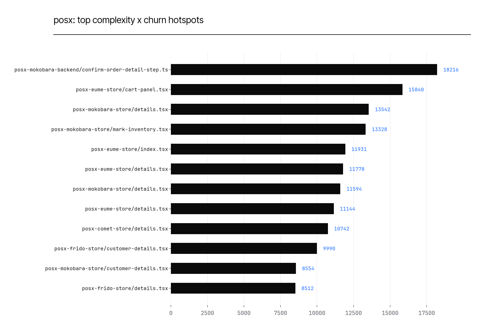

# posx — Dependency *Graph* & Hotspots

*Internal import graph via `dependency-cruiser` (JS/TS), restricted to modules whose own source
is not under `node_modules` -- an early pass in building this tool nearly reported hundreds of
false "circular dependency" hits that were entirely inside third-party packages' own internals;
see `docs/METHODOLOGY.md`. Complexity via `lizard` (all languages) joined against `code-maat`
churn: `hotspot_score = total_ccn(file) x n_revisions(file)` (Tornhill). Coupling via
`code-maat`'s temporal-coupling analysis (files that change together, independent of any import
between them). Data: `depgraph_summary.csv`, `complexity_hotspots.csv`, `churn_coupling.csv`.
Chart: `charts/hotspots_top.png`.*

## 1. Internal circular dependencies

20 of 26 repos analyzed (6 skipped -- see below).
**19 of 20 have zero internal circular dependencies.**

| Repo | Internal modules | Circular deps | Orphans |
|---|---|---|---|
| posx-comet-admin | 3713 | 0 | 50 |
| posx-comet-backend | 1278 | 0 | 18 |
| posx-demo-admin | 3500 | 0 | 46 |
| posx-demo-backend | 843 | 0 | 11 |
| posx-eume-admin | 3571 | 0 | 48 |
| posx-eume-backend | 1288 | 0 | 18 |
| posx-frido-admin | 3789 | 0 | 54 |
| posx-frido-b2b-admin | 3594 | 0 | 49 |
| posx-frido-b2b-backend | 971 | 0 | 71 |
| posx-frido-backend | 1385 | 0 | 30 |
| posx-frido-mobility-admin | 3613 | 0 | 48 |
| posx-frido-mobility-backend | 1047 | 0 | 23 |
| posx-kb | 139 | 0 | 3 |
| posx-mokobara-admin | 3940 | 0 | 58 |
| posx-mokobara-backend | 1335 | 32 | 34 |
| posx-mokobara-clearance-backend | 921 | 0 | 20 |
| posx-mokobara-store | 963 | 0 | 30 |
| posx-ugaoo-admin | 3762 | 0 | 54 |
| posx-ugaoo-backend | 1568 | 0 | 35 |
| posx-ugaoo-store | 863 | 0 | 25 |

### Skipped

| Repo | Reason |
|---|---|
| posx-comet-store | no node_modules (npm install failed) |
| posx-demo-store | no node_modules (npm install failed) |
| posx-eume-store | no node_modules (npm install failed) |
| posx-frido-b2b-store | no node_modules (npm install failed) |
| posx-frido-mobility-store | no node_modules (npm install failed) |
| posx-frido-store | no node_modules (npm install failed) |

## 2. Complexity x churn hotspots

The files where cyclomatic complexity and change frequency compound -- where defects
concentrate, per Tornhill's "Your Code as a Crime Scene" methodology:

| Repo | File | Total CCN | Max fn CCN | Revisions | Hotspot score |
|---|---|---|---|---|---|
| posx-mokobara-backend | src/workflows/order-detail/steps/confirm-order-detail-step.ts | 198 | 82 | 92 | 18216 |
| posx-eume-store | src/components/app/product/cart-panel.tsx | 330 | 103 | 48 | 15840 |
| posx-mokobara-store | src/pages/exchanges/details.tsx | 366 | 45 | 37 | 13542 |
| posx-mokobara-store | src/pages/inventory/mark-inventory.tsx | 272 | 19 | 49 | 13328 |
| posx-eume-store | src/components/app/home/index.tsx | 291 | 59 | 41 | 11931 |
| posx-eume-store | src/pages/exchanges/details.tsx | 302 | 21 | 39 | 11778 |
| posx-mokobara-store | src/pages/products/details.tsx | 374 | 61 | 31 | 11594 |
| posx-eume-store | src/pages/products/details.tsx | 398 | 106 | 28 | 11144 |
| posx-comet-store | src/pages/products/details.tsx | 262 | 107 | 41 | 10742 |
| posx-frido-store | src/pages/online-orders/details/customer-details.tsx | 370 | 93 | 27 | 9990 |
| posx-mokobara-store | src/pages/orders/details/customer-details.tsx | 329 | 67 | 26 | 8554 |
| posx-frido-store | src/pages/products/details.tsx | 266 | 18 | 32 | 8512 |

## 3. Logical/temporal coupling

Files that change together across commits, whether or not either imports the other -- often
reveals coupling an import graph alone would miss:

| Repo | Entity | Coupled with | Co-change degree |
|---|---|---|---|
| posx-comet-backend | src/workflows/cart/workflows/remove-campaign-coupon.ts | src/workflows/cart/workflows/remove-promotional-coupon.ts | 100 |
| posx-comet-backend | src/workflows/cart/apply-promotional-coupon.ts | src/workflows/cart/remove-from-cart.ts | 100 |
| posx-comet-backend | src/api/order-payment/route.ts | src/api/order-product/route.ts | 100 |
| posx-comet-backend | src/workflows/cart/apply-promotional-coupon.ts | src/workflows/cart/remove-promotional-coupon.ts | 100 |
| posx-comet-backend | src/workflows/cart/remove-from-cart.ts | src/workflows/cart/remove-promotional-coupon.ts | 100 |
| posx-comet-store | src/pages/gift-card/top-up/razorpay-form.tsx | src/pages/gift-card/top-up/razorpay-pos-form.tsx | 100 |
| posx-eume-admin | src/routes/employees/employee-create/components/employee-create-form/employee-create-form.tsx | src/routes/employees/types.ts | 100 |
| posx-eume-admin | src/routes/store-coupons/coupon-create/components/coupon-create-form/coupon-create-form.tsx | src/routes/store-coupons/coupon-edit/components/edit-coupon-form.tsx | 100 |
| posx-eume-admin | src/routes/store-coupons/coupon-edit/components/edit-coupon-form.tsx | src/routes/store-coupons/types.ts | 100 |
| posx-eume-admin | src/routes/store-coupons/coupon-detail/components/discount-info-section.tsx | src/routes/store-coupons/types.ts | 100 |

## 4. Honest limitations

- Coupling by co-change does not distinguish "these files are properly related" from "this is
  an unnecessary coupling that should be refactored away" -- read the actual files before
  concluding either way.
- A circular-dependency count of 0 (or a low count of legitimate parent-child model pairs) does
  not mean the architecture has no problems -- it means this specific, narrow measurement
  found none. It says nothing about coupling *between* repos.

*Raw data: `depgraph_summary.csv`, `complexity_hotspots.csv`, `churn_coupling.csv`,
`depgraph_raw/*.json` (full per-repo graphs, regenerate via the `depgraph` module -- not
archived, see METHODOLOGY.md).*
