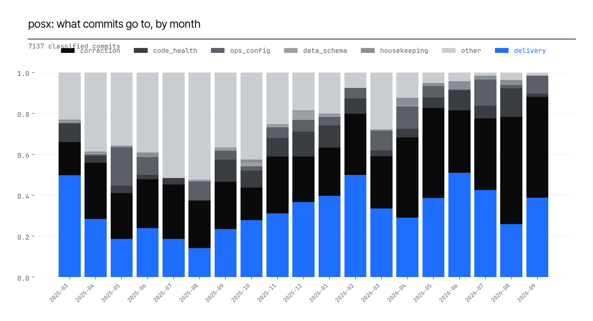

# posx — Engineering Effort *Allocation*

*Basis: all 7137 non-merge, ontology-classified commits, joined with authorship and the
files each commit touched. Toil clusters are found mechanically (grouped by repo + directory +
category, flagged above 15 commits) -- each is a candidate worth a human diff-read, not a
verified finding the way a hand-audited deep-dive would be. Data: `effort_by_author.csv`,
`effort_monthly_share.csv`, `effort_toil_clusters.csv`. Chart: `charts/effort_share_over_time.png`.*

## 1. Where the commits go, over time

28
authors have 20+ commits; their median Delivery share is **27.19%**.

## 2. Candidate toil clusters

72 clusters found, covering **3060 commits
(42.9% of all classified work)** -- repeated, mechanical, same-location work that isn't
new-feature delivery:

| Repo | Location | Category | Commits | Authors | Span |
|---|---|---|---|---|---|
| posx-mokobara-store | src/components | correction | 136 | 11 | 2025-11-13 to 2026-09-03 |
| posx-mokobara-backend | src/workflows | correction | 135 | 8 | 2025-11-20 to 2026-09-02 |
| posx-comet-store | src/components | correction | 121 | 12 | 2025-03-16 to 2026-08-31 |
| posx-comet-backend | src/workflows | correction | 108 | 12 | 2025-03-18 to 2026-08-26 |
| posx-comet-backend | src/workflows | other | 85 | 7 | 2025-03-13 to 2026-07-02 |
| posx-frido-backend | src/workflows | correction | 81 | 6 | 2025-07-23 to 2026-09-03 |
| posx-mokobara-store | src/components | other | 80 | 8 | 2025-10-28 to 2026-08-24 |
| posx-eume-backend | src/workflows | correction | 72 | 8 | 2025-08-29 to 2026-08-26 |
| posx-frido-backend | src/api | correction | 70 | 4 | 2025-07-28 to 2026-08-26 |
| posx-frido-store | src/components | other | 70 | 6 | 2025-07-11 to 2026-04-20 |
| posx-mokobara-backend | src/api | correction | 68 | 9 | 2025-11-19 to 2026-09-02 |
| posx-mokobara-store | src/pages | correction | 67 | 7 | 2025-11-28 to 2026-09-03 |
| posx-comet-store | src/components | other | 66 | 7 | 2025-03-17 to 2026-08-25 |
| posx-frido-backend | src/workflows | other | 66 | 5 | 2025-07-18 to 2026-06-22 |
| posx-mokobara-admin | src/routes | correction | 65 | 9 | 2025-11-21 to 2026-09-02 |

## 3. Per-author breakdown (top 12 by volume)

| Author | Commits | Delivery % | Correction % | Ops/config % |
|---|---|---|---|---|
| kaushal.padaliya@devxconsultancy.com | 1208 | 32.12 | 36.09 | 2.57 |
| rachit.shah@devxconsultancy.com | 1068 | 51.69 | 32.58 | 1.59 |
| yashkumar.parmar@devxlabs.ai | 784 | 49.87 | 20.92 | 1.91 |
| dhruv.parekh@devxconsultancy.com | 434 | 27.19 | 30.65 | 0.46 |
| vishal.makwana@devxconsultancy.com | 404 | 26.73 | 22.52 | 6.19 |
| jaydeep.pipaliya@devxlabs.ai | 337 | 25.82 | 58.16 | 8.31 |
| karan181716@gmail.com | 302 | 9.6 | 12.58 | 0.33 |
| kritik.jiyaviya@devxconsultancy.com | 297 | 69.02 | 9.43 | 0.34 |
| vinay.software.com@gmail.com | 255 | 48.24 | 39.61 | 0.0 |
| 262339854+jaydeep-devx@users.noreply.github.com | 226 | 42.04 | 49.12 | 0.0 |
| jinang.vohera@devxlabs.ai | 209 | 25.84 | 64.59 | 2.39 |
| bhagyashree@devxconsultancy.com | 195 | 6.67 | 20.0 | 16.92 |

## 4. Honest limitations

- Clusters are grouped by directory prefix and category only -- two unrelated recurring
  patterns in the same directory (e.g. both config tweaks and bug fixes under one feature's
  folder) will merge into one cluster row. Read `sample_subjects` in the raw CSV before citing
  a cluster's size as evidence of one specific problem.
- No effort/build-cost estimate is attached to any cluster (unlike a hand-authored toil
  deep-dive) -- that requires product/ownership context this tool does not have. Use the
  cluster list to prioritize *which* areas to investigate, not as a ready-made remediation plan.
- Per-author percentages are a commit-count proxy for effort, not a performance measure --
  commit size varies enormously by type of work; a single infra commit can be larger than ten
  feature commits combined. Do not rank authors by this table.

*Raw data: `effort_by_author.csv`, `effort_monthly_share.csv`, `effort_toil_clusters.csv`.*
