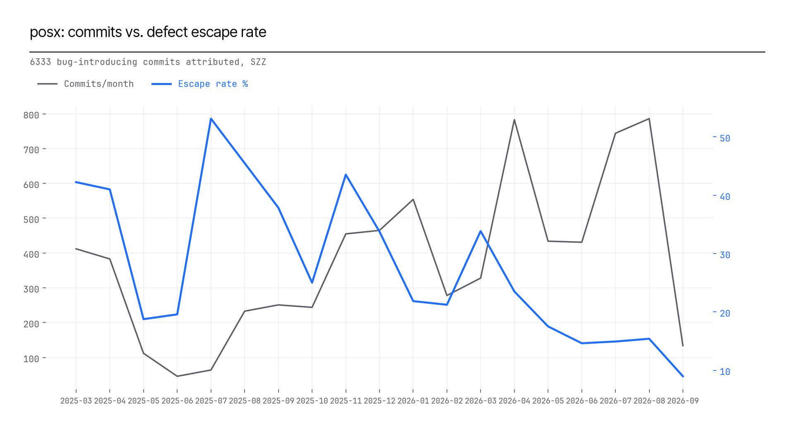

# posx — Defect *Escape* Rate (SZZ)

*A defect escape is dated to the commit that **introduced** it, not the commit that fixed it --
that is the moment whatever testing/review/CI existed on that day either caught it or didn't.
Implemented via the SZZ algorithm (Sliwerski/Zimmermann/Zeller): for each non-merge commit this
tool's ontology classifier calls `bug_fix` or `revert`, `git blame` at the fix's parent commit
attributes the deleted/modified lines back to their origin. Window: 365 days. Data:
`escapes.csv`, `escape_monthly.csv`, `escape_summary.json`. Chart: `charts/escape_trend.png`.*

## 1. Results

**6333 bug-introducing commits attributed.** Fix
latency: median **22 days**, p90
**242 days** -- one defect in ten survives that long before
its fix lands.

The trend is **declining**: the earliest observed cohorts ran 19-42%, the most recent
observed months run 9-15%.

## 2. By repo (highest attributed escape count)

| Repo | Attributed escapes |
|---|---|
| posx-mokobara-backend | 979 |
| posx-comet-store | 917 |
| posx-comet-backend | 801 |
| posx-mokobara-store | 740 |
| posx-frido-backend | 666 |
| posx-eume-backend | 361 |
| posx-ugaoo-backend | 353 |
| posx-ugaoo-store | 336 |
| posx-mokobara-admin | 267 |
| posx-eume-store | 235 |

## 3. Honest limitations

- This is line-based SZZ without the meta-change/line-mapping refinements from SZZ RA/SZZ
  Unleashed, which correct for lines that moved rather than changed and filter cosmetic
  reformatting -- expect some inflation toward reformatting-adjacent commits.
- Detection bias is irreducible in git-only data: an escape is only visible once someone wrote
  a fix commit for it. A repo with less code review scrutiny will always measure artificially
  safer than it really is.
- Depends entirely on the ontology classifier's `bug_fix`/`revert` recall -- if that classifier
  under-detects fixes (check `ONTOLOGY_AUDIT.md`), escape rates here are a conservative floor,
  not the true rate.
- Pure-addition fix commits (no deleted lines) carry no blame target and are excluded from
  attribution -- see `escape_summary.json`'s `per_repo_fix_commit_stats` for the excluded count
  per repo.

*Raw data: `escapes.csv`, `escape_monthly.csv`.*
