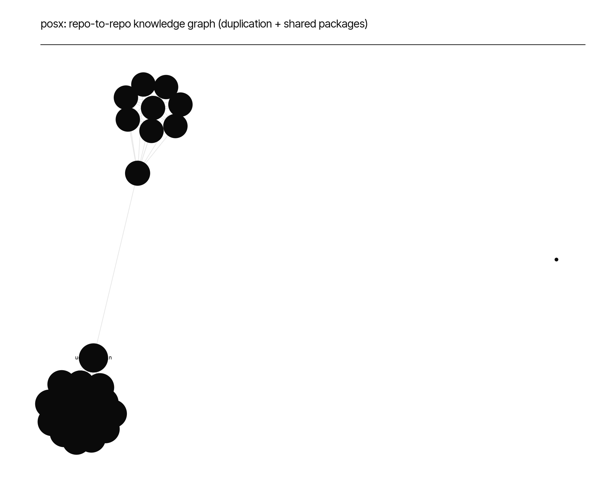

# posx — *Knowledge* Graph

*A real, exported graph artifact -- `knowledge_graph.graphml` -- not a description of one.
Standard GraphML: loads directly in Gephi, yEd, Neo4j (`neo4j-admin database import`), igraph,
or networkx (`nx.read_graphml(...)`). Built by assembling every relationship this tool has
already computed into one graph, re-scanning nothing: **DUPLICATE_OF** edges (repo<->repo,
weighted by count of byte-identical files -- `exact_duplicates.py`'s sha256 output, not a
heuristic), **SHARES_PACKAGE** edges (repo<->repo, weighted by shared npm dependency count,
>=5 floor), **COUPLED_WITH** edges (file<->file within one repo, weighted by code-maat's
temporal-coupling degree). Round-trip verified: exported, reloaded, and spot-checked against
known-real duplication counts before being reported here.*

## 1. What's in it

**1075 nodes** (26 repos,
1049 files that participate in at least one coupling relationship),
**2195 edges**:

| Edge type | Count |
|---|---|
| DUPLICATE_OF | 186 |
| SHARES_PACKAGE | 312 |
| COUPLED_WITH | 1697 |



## 2. Most-connected repos

| Repo | Degree (dup + shared-package connections) |
|---|---|
| posx-ugaoo-admin | 46 |
| posx-mokobara-store | 44 |
| posx-comet-store | 44 |
| posx-frido-store | 44 |
| posx-mokobara-admin | 44 |
| posx-eume-store | 44 |
| posx-ugaoo-store | 44 |
| posx-frido-admin | 44 |
| posx-comet-admin | 44 |
| posx-eume-admin | 44 |

## 3. How to query it yourself

```python
import networkx as nx
G = nx.read_graphml("knowledge_graph.graphml")
# every repo this one shares 100+ identical files with:
[(u, v, d["weight"]) for u, v, d in G.edges("repo:posx-ugaoo-admin", data=True)
 if d.get("type") == "DUPLICATE_OF" and d["weight"] > 100]
```

## 4. Honest limitations

- File-level nodes exist only for `COUPLED_WITH` (within-repo) relationships -- the portfolio's
  full within-repo import graphs (thousands of file nodes each) live separately in
  `depgraph_raw/*.json` per repo, not merged into this graph, to keep it at a size actually
  useful to open in a graph tool rather than an unreadable hairball.
- `SHARES_PACKAGE` is direct dependencies only (not transitive) and floors at 5+ shared
  packages to filter noise (every repo shares *some* common package).
- No cross-repo `CALLS` edges are in this graph -- `ARCHITECTURE.md`'s codebase-memory-mcp
  capture already established that number is zero for the 3 repos it indexed.

*Artifact: `knowledge_graph.graphml`. Raw stats: `knowledge_graph_stats.json`.*
