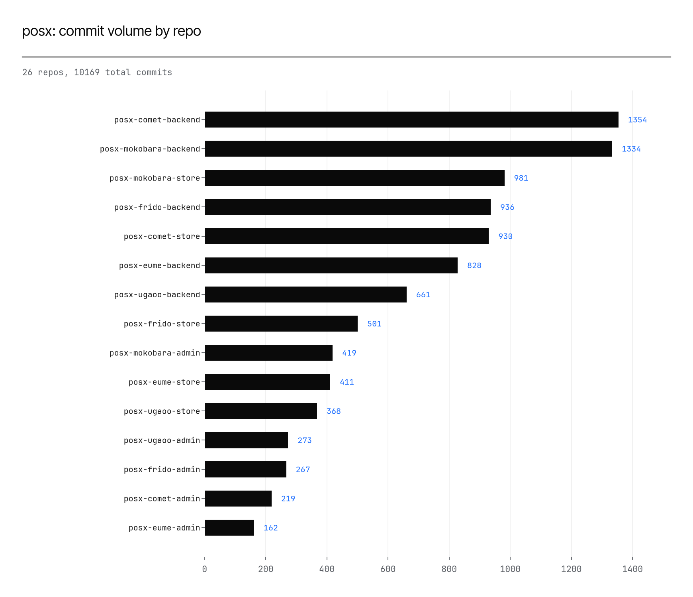

# posx — Repository *Analysis*

*Generated from `git log` history in each of 26 repos. Tiers are by days since last
commit; bus-factor is the Gini coefficient of each repo's per-author commit share (0 = evenly
spread, 1 = one author owns everything). Data: `inventory.csv`. Chart: `charts/repo_activity_top15.png`.*

## 1. Distribution at a glance

| Bucket | Definition | Count |
|---|---|---|
| Active | <=90 days since last commit | 26 |
| Recent | 90d-1yr | 0 |
| Aging | 1-3yr | 0 |
| Dormant | >3yr | 0 |

Total commits across the portfolio: **10169**. Median bus-factor Gini across all
repos: **0.596**.

## 2. Most active repos by volume

| Repo | Commits | Authors | Bus-factor Gini | Top author share |
|---|---|---|---|---|
| posx-comet-backend | 1354 | 27 | 0.6633 | 0.2821 |
| posx-mokobara-backend | 1334 | 26 | 0.7902 | 0.3913 |
| posx-mokobara-store | 981 | 24 | 0.7212 | 0.3242 |
| posx-frido-backend | 936 | 21 | 0.6968 | 0.3141 |
| posx-comet-store | 930 | 26 | 0.6772 | 0.2774 |
| posx-eume-backend | 828 | 23 | 0.6468 | 0.2995 |
| posx-ugaoo-backend | 661 | 16 | 0.7108 | 0.3646 |
| posx-frido-store | 501 | 19 | 0.5826 | 0.2335 |
| posx-mokobara-admin | 419 | 23 | 0.6998 | 0.3866 |
| posx-eume-store | 411 | 21 | 0.4729 | 0.1995 |
| posx-ugaoo-store | 368 | 14 | 0.6848 | 0.3967 |
| posx-ugaoo-admin | 273 | 13 | 0.6374 | 0.4432 |
| posx-frido-admin | 267 | 16 | 0.6084 | 0.3483 |
| posx-comet-admin | 219 | 20 | 0.54 | 0.3607 |
| posx-eume-admin | 162 | 15 | 0.484 | 0.1975 |

## 3. Bus-factor / key-person risk

Repos where one author holds more than 70% of all commits -- the highest key-person risk in
the portfolio:

| Repo | Top author share | Authors | Commits |
|---|---|---|---|
| posx-kb | 1.0 | 1 | 5 |
| posx-mokobara-clearance-backend | 0.94 | 2 | 50 |
| posx-frido-b2b-store | 0.8906 | 3 | 64 |
| posx-frido-b2b-backend | 0.7833 | 6 | 120 |
| posx-frido-b2b-admin | 0.7619 | 2 | 42 |

## 4. Honest limitations

- Tiering uses raw last-commit date; this tool does not attempt to detect and exclude
  org-wide automated batch commits (e.g. a mass tooling migration) the way a human analyst
  reviewing the corpus might. A single such batch commit across many repos would understate
  how dormant those repos really are -- check `last_commit` against `top_author` for repos
  where they look suspicious before trusting the tier.
- Bus-factor Gini is computed over the repo's *entire* history, not a recent window --
  a repo that was single-author at launch and later grew a real team will still show an
  elevated historical Gini.

*Raw data: `inventory.csv`.*
